# Data Flow Diagram — secure-sdlc-lab Flask App

This diagram renders automatically on GitHub.
It maps data flows across trust boundaries, which is the basis for STRIDE analysis.

> **How to read this:** rectangles = processes/entities, cylinders = data stores,
> dashed borders = trust boundaries, red labels = attack vectors confirmed in threat model.

```mermaid
flowchart TD
    %% External actors
    Browser(["🌐 Browser / Attacker\n(Untrusted external)"])
    ZAP(["🔍 OWASP ZAP\n(DAST scanner)"])

    %% Trust boundary — internet
    subgraph INTERNET ["⚠️  INTERNET — Untrusted Zone"]
        Browser
        ZAP
    end

    %% Trust boundary — application
    subgraph APP ["🔒 Flask Application Boundary — :5000"]

        subgraph ROUTES ["HTTP Route Handlers"]
            R_LOGIN["/login\n[V-01 SQL Injection]"]
            R_PING["/ping\n[V-02 Command Injection]"]
            R_SEARCH["/search\n[V-06 Reflected XSS]"]
            R_USER["/user/id\n[V-09 IDOR]"]
            R_FILE["/read-file\n[V-05 Path Traversal]"]
            R_HASH["/hash\n[V-07 Weak MD5]"]
            R_REDIRECT["/redirect\n[V-10 Open Redirect]"]
            R_DESER["/deserialize\n[V-04 Pickle RCE]"]
        end

        subgraph INTERNAL ["Internal Resources"]
            DB[("🗄️ SQLite DB\nin-memory\nusers table")]
            FS[("📁 Filesystem\n/etc/passwd\n/etc/shadow\napp.py")]
            OS_SHELL["💻 OS Shell\nsubprocess\n[V-02]"]
            PICKLE["🐍 pickle.loads()\n[V-04]"]
            WERKZEUG["🐛 Werkzeug Debugger\ndebug=True\n[V-08]"]
        end

        HARDCODED["🔑 Hardcoded Secrets\nSECRET_KEY\nDB_PASSWORD\n[V-03]"]
    end

    %% Data flows — browser to routes
    Browser -->|"GET ?user= &pass=\nUnsanitised SQL input"| R_LOGIN
    Browser -->|"GET ?host=\nUnsanitised shell input"| R_PING
    Browser -->|"GET ?q=\nUnescaped HTML output"| R_SEARCH
    Browser -->|"GET /user/N\nNo auth check"| R_USER
    Browser -->|"GET ?name=../../etc/passwd\nNo path check"| R_FILE
    Browser -->|"POST body\nPickle bytes"| R_DESER
    Browser -->|"GET ?url=\nNo allowlist"| R_REDIRECT
    ZAP -->|"Active scan\nHTTP requests"| ROUTES

    %% Data flows — routes to internal resources
    R_LOGIN -->|"SELECT * WHERE username='...'\nString concat"| DB
    R_PING -->|"ping -c 1 {host}\nshell=True"| OS_SHELL
    R_FILE -->|"open(name)\nNo realpath check"| FS
    R_DESER -->|"pickle.loads(raw)\nArbitrary Python"| PICKLE
    R_USER -->|"SELECT WHERE id=N\nNo session check"| DB

    %% Werkzeug debugger exposure
    R_DESER -->|"500 error\nExposes REPL"| WERKZEUG
    WERKZEUG -->|"PIN derivable via\n/proc + /etc/machine-id"| FS

    %% Hardcoded secrets
    HARDCODED -->|"SECRET_KEY used to\nsign session cookies"| APP

    %% Attack outcomes — what an attacker gets
    DB -->|"All usernames\npasswords, roles"| Browser
    OS_SHELL -->|"Arbitrary OS\ncommand output"| Browser
    FS -->|"File contents\n/etc/passwd etc."| Browser
    PICKLE -->|"RCE — arbitrary\nPython execution"| Browser
    WERKZEUG -->|"Python REPL\nfull server access"| Browser

    %% Styling
    classDef vuln fill:#FCEBEB,stroke:#E24B4A,color:#501313
    classDef store fill:#E6F1FB,stroke:#185FA5,color:#042C53
    classDef external fill:#F1EFE8,stroke:#5F5E5A,color:#2C2C2A
    classDef secret fill:#FAEEDA,stroke:#BA7517,color:#412402

    class R_LOGIN,R_PING,R_SEARCH,R_USER,R_FILE,R_HASH,R_REDIRECT,R_DESER vuln
    class DB,FS store
    class Browser,ZAP external
    class HARDCODED secret
    class OS_SHELL,PICKLE,WERKZEUG vuln
```

---

## Trust Boundaries Explained

### Boundary 1 — Internet → Flask app
Everything crossing this boundary is attacker-controlled.
No authentication exists at the app level — any HTTP client can reach any endpoint.

Attack surface crossing this boundary:
- Query parameters (`user`, `pass`, `host`, `q`, `name`, `url`)
- POST body (pickle bytes to `/deserialize`)
- URL path segments (`/user/<id>`)

### Boundary 2 — Flask app → OS
The `/ping` endpoint crosses this boundary with user-controlled data.
`shell=True` means the OS shell interprets the full string, allowing
injection of additional commands via `;`, `&&`, `|`, `$()`.

### Boundary 3 — Flask app → Filesystem
The `/read-file` endpoint crosses this boundary with user-controlled paths.
Without `os.path.realpath()` checks, `../` sequences traverse up the directory
tree and reach any file the process can read.

### Boundary 4 — Flask app → Python interpreter (pickle)
`pickle.loads()` doesn't just deserialise data — it executes Python bytecode.
User-controlled bytes crossing this boundary can contain arbitrary `__reduce__`
methods that run any OS command during deserialization.

---

## How to Use This with OWASP Threat Dragon

1. Open Threat Dragon
2. Create a new threat model
3. Draw the same diagram:
   - Add an **External Actor** box for Browser/Attacker
   - Add a **Process** box for the Flask app
   - Add **Data Stores** for SQLite DB and Filesystem
   - Draw **Data Flows** between them
   - Mark the **Trust Boundary** between internet and app
4. For each data flow, Threat Dragon will prompt you to add threats
5. Map your STRIDE findings from `THREAT_MODEL.md` to the flows

The Threat Dragon file (`.json`) can be exported and committed to
`threat-model/threat-dragon-model.json` as an additional artifact.
